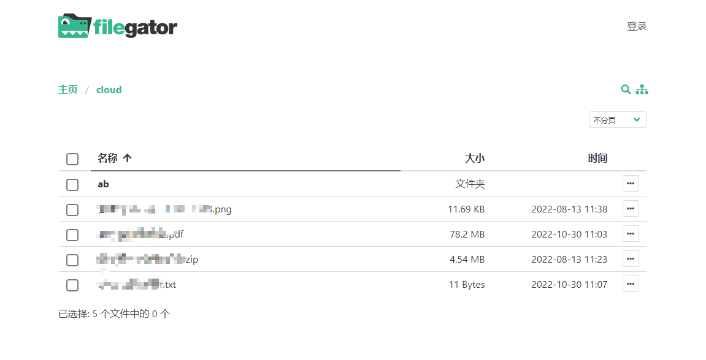

## 项目介绍

使用[filegator](https://github.com/filegator/filegator) + 阿里云OSS Flysystem适配器 搭建网盘、下载站，优点在于不限速、可在线预览和修改基本的文件

阿里云OSS Flysystem适配器来源于[xxtime/flysystem-aliyun-oss](https://github.com/xxtime/flysystem-aliyun-oss)



最近在使用阿里云对象存储的时候，发现阿里云OSS新增加了个对象数据索引的功能，这使得使用阿里云OSS提供的Flysystem适配器和第三方文件管理系统搭建网盘成为了可能。（在之前阿里云OSS未添加该功能时，使用文件系统访问OSS数据，在第一次加载需要五秒或更长时间，而现在，可以在0.5s内完成数据访问操作。）

文件系统我们这里选择开源项目[FileGator v7.8.2](https://github.com/filegator/filegator)（默认账户：admin，默认密码：admin123）

### 环境要求

- PHP >= 8.0.2

### 配置

在configuration.php文件中的配置如下：

特别注意点：由于未知因素，filegator链接阿里云不能直接使用根目录`/`，必需在阿里云OSS中新建一个文件夹，并将配置中的`separator`项目修改为这个新的文件夹，即`'separator' => 'new_folder/'`

```php
'config' => [
                'separator' => 'cloud/', // 使用阿里云OSS时，一定要修改源路径为新建文件夹的路径
                'config' => [],
                'adapter' => function () {
                    $config = [
                        'accessId'       => 'accessId',
                        'accessSecret'   => 'accessSecret',
                        'bucket'         => 'bucket',
                        'endpoint'       => 'oss-cn-hangzhou.aliyuncs.com',
                        'timeout'        => 3600,
                        'connectTimeout' => 10,
                        'isCName'        => false,
                        // 'token'          => '',
                    ];
                    $aliyun = new OssAdapter($config);//aliyun OSS SDK Flysystem API
                    return $aliyun;
                    // 使用本地目录
                    // $replica = new \League\Flysystem\Adapter\Local(__DIR__.'/repository');
                    // return $replica;
                    // 复制适配器，文档参考见 https://docs.filegator.io/configuration/storage.html
                    // return new League\Flysystem\Replicate\ReplicateAdapter($sources, $replica);
                },
            ],
```

| 配置项            | 必须 | 说明                                | 备注             |
| ----------------- | ---- | ----------------------------------- | ---------------- |
| access_id         | 是   | 用于身份验证的 AccessKey ID         | 见下文“安全提醒” |
| access_key_secret | 是   | 用于身份验证的 AccessKey Key Secret | 见下文“安全提醒” |
| bucket            | 是   | 存储空间名称                        | -                |
| endpoint          | 是   | 地域节点                            |                  |

#### 安全提醒

为了安全，请使用子账户的 AccessKey ID 和 AccessKey Key Secret，请务必不要使用主账户的 AccessKey ID 和 AccessKey Key Secret
